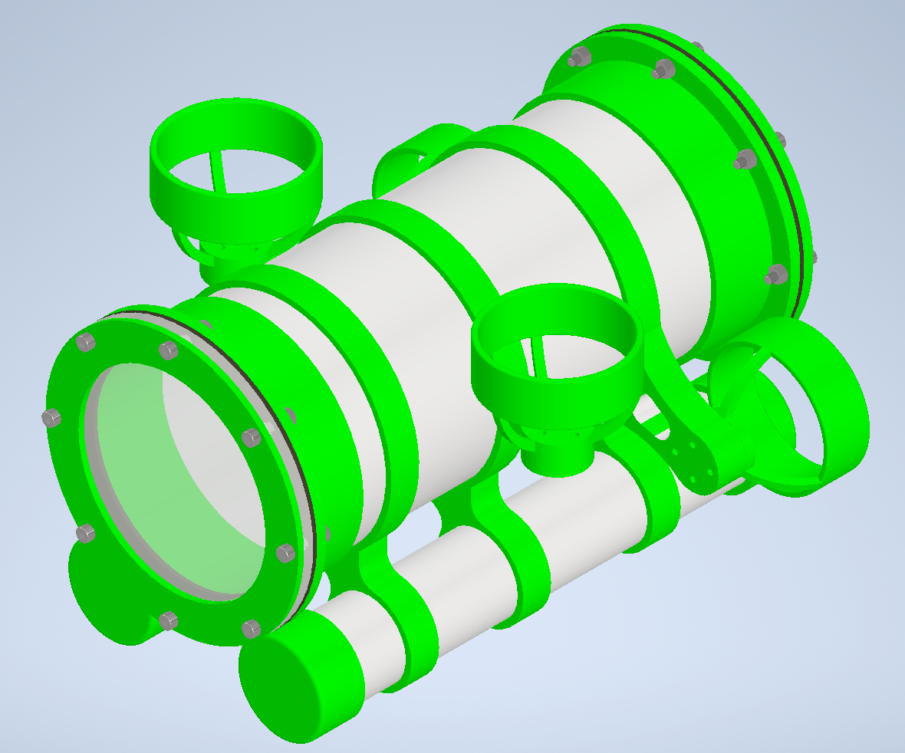
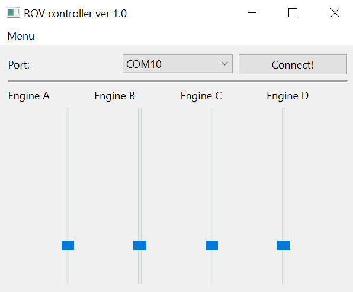

# ROV_Controller-ver-1.0

### Overview 

This is a dekstop app that will help to test and control an underwater ROV (which project is shown on a image above).
It uses PySide6 to generate a GUI and Serial library to establish a connection via USB port.

When the button is pressed, it sends two bytes of data:
- first byte contains the information about a name of an engine in ASCII format( there are 4 possibilities : 'A' letter corresponds to left engine, 'B' letter corresponds to right engine, 'C' letter corresponds to upper left engine and 'D' letter corresponds to upper right engine)
- seconds byte contains the information about desired speed ( which is an int value in range <0;250> - this value is then converted by IC to an according pulse width in PWM)

The data is then sent via chosen usb port and later, via cable and RS495 converters to STM32 IC.

### How to use 

In order to establish connection a proper USB port needs to be chosen first. Then, with the help of 4 sliders a speed of each motor can be precisely set. 
The sliders are used to set a speed of all 4 motors.

Following keys trigger do as follows:

 - "W" key sets speed values to upper motors ( tells the ROV to swim up)
 - "S" key turns off both upper motors ( the ROV will sink) 
 - "J" key turns on the right motor and turns off the left motor ( turns the ROV right)
 - "L" key turns on the left motor and turns off the right motor ( turns the ROV left)
 - "I" key turn on left and right motor ( commands a ROV to swim straight)
 - "K" key turns of left and right motor ( stops ROV)
  
  

